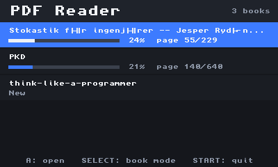
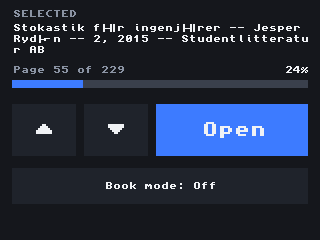
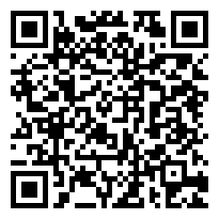

# 3DS PDF Reader

Read your PDF books and documents on a Nintendo 3DS.

<p align="center">
  <br>
  
</p>

## Features

- **Library** – every PDF on your SD card in one list, most recently read first,
  with a progress bar for each book.
- **Picks up where you left off** – your page is saved for every book.
- **Comfortable reading** – the page fills the top screen; scroll with the
  D-pad or circle pad and keep going straight onto the next page.
- **Zoom** – zoom in on small text and pan around with the stylus or circle pad.
- **Book mode** – hold the 3DS sideways like a book and read two pages at once,
  one on each screen. Tap the bottom screen to turn the page.
- **Jump to any page** – tap the page counter and type a page number.
- **Touch friendly** – open books, turn pages and pan with the stylus.

## Installation

You need a 3DS with custom firmware (for example
[Luma3DS](https://3ds.hacks.guide/)).

Download the latest files from the
[Releases](../../releases) page.

### Install over Wi-Fi (QR code)

1. Open **FBI** and choose **Remote Install → Scan QR Code**.
2. Scan this code. FBI downloads and installs the latest version:

<p align="center">
  
</p>

3. Start **3DS PDF Reader** from the HOME Menu.

Every release page also has a QR code for that exact version.

### Install from the SD card (.cia)

1. Copy `3dsToPdf.cia` to your SD card.
2. Open **FBI**, go to **SD**, select the file and choose **Install CIA**.
3. Start **3DS PDF Reader** from the HOME Menu.

### Homebrew Launcher (.3dsx)

1. Copy `3dsToPdf.3dsx` to `/3ds/3dsToPdf/` on your SD card.
2. Start it from the Homebrew Launcher.

## Adding books

1. Turn off the 3DS and put the SD card in your computer
   (or use an FTP app such as FTPD to copy files over Wi-Fi).
2. Create a folder called `pdf` at the root of the SD card.
3. Copy your `.pdf` files into it:

```
SD card
└── pdf/
    ├── my-book.pdf
    ├── manual.pdf
    └── ...
```

4. Start the app — your books show up in the library.

## Controls

| Where | Input | Action |
|-------|-------|--------|
| Library | D-pad / ▲ ▼ buttons | Choose a book |
| Library | **A** / **Open** | Open the book |
| Anywhere | **SELECT** | Book mode on / off |
| Reader | **L** / **R**, tap left / right edge | Previous / next page |
| Reader | D-pad, circle pad, stylus drag | Scroll and pan |
| Reader | **Y**, then D-pad Up / Down | Zoom (**X** resets) |
| Book mode | Tap bottom screen, **R** | Next two pages |
| Book mode | **L** | Previous two pages |
| Book mode | **A** / **Y** | Zoom in / out (**X** resets) |
| Anywhere | **START** | Back to the library / quit |

---

Want to build it yourself? See [BUILDING.md](BUILDING.md).

This project uses [MuPDF](https://mupdf.com/), licensed under the GNU AGPL.
All original code in this repository is provided under the MIT License.
